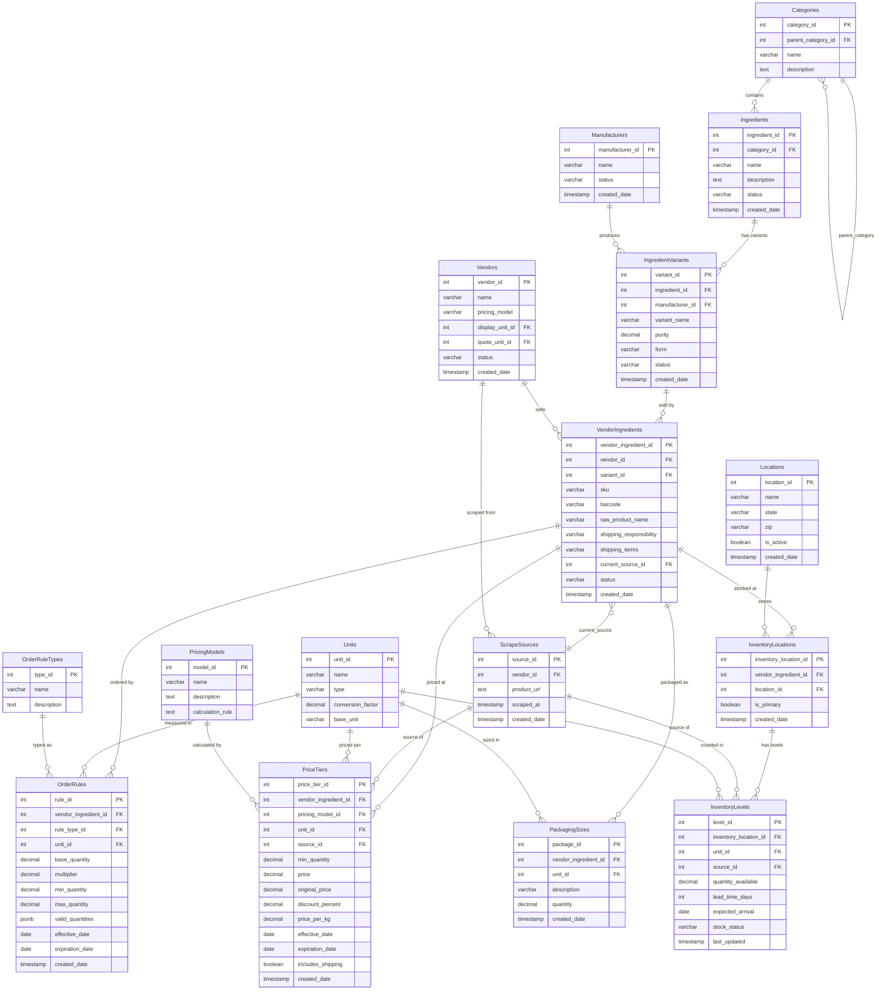

# Ingredient Database - Technical Documentation

## Table of Contents
1. [Domain-Driven Design](#domain-driven-design)
2. [Entity Relationship Diagram](#entity-relationship-diagram)
3. [Database Schema](#database-schema)
4. [Data Dictionary](#data-dictionary)
5. [Import Mappings](#import-mappings)

---

## Domain-Driven Design

### Overview

This system manages ingredient sourcing for a contract manufacturing business, handling complex pricing structures, multiple vendor relationships, manufacturer quality tracking, inventory across locations, and various ordering restrictions.

### Ubiquitous Language

| Term | Definition |
|------|------------|
| **Ingredient** | A base raw material (e.g., "Vitamin C", "Whey Protein Isolate") |
| **Variant** | A specific form/purity/manufacturer combination of an ingredient |
| **Vendor** | A company that sells ingredients (e.g., IngredientsOnline, BulkSupplements) |
| **Manufacturer** | The company that produces the ingredient (quality varies by manufacturer) |
| **Price Tier** | A quantity threshold that triggers a different price point |
| **Order Rule** | Constraints on how products can be ordered (multiples, minimums, pack sizes) |
| **Scrape Source** | A record of when/where pricing data was collected |
| **Lead Time** | Days until inventory is available to ship |

### Bounded Contexts

```
┌─────────────────────────────────────────────────────────────────────────────┐
│                           INGREDIENT CATALOG                                 │
│  ┌──────────────┐  ┌────────────────────┐  ┌──────────────────┐            │
│  │  Categories  │  │    Ingredients     │  │  Manufacturers   │            │
│  └──────────────┘  └────────────────────┘  └──────────────────┘            │
│                              │                       │                      │
│                    ┌─────────┴───────────────────────┘                      │
│                    ▼                                                        │
│           ┌────────────────────┐                                            │
│           │ IngredientVariants │                                            │
│           └────────────────────┘                                            │
└─────────────────────────────────────────────────────────────────────────────┘
                                       │
                                       ▼
┌─────────────────────────────────────────────────────────────────────────────┐
│                              VENDOR SOURCING                                 │
│  ┌──────────────┐  ┌────────────────────┐  ┌──────────────────┐            │
│  │   Vendors    │──│  VendorIngredients │──│   ScrapeSources  │            │
│  └──────────────┘  └────────────────────┘  └──────────────────┘            │
│                              │                                              │
│              ┌───────────────┼───────────────┐                              │
│              ▼               ▼               ▼                              │
│     ┌─────────────┐  ┌─────────────┐  ┌───────────────┐                    │
│     │ OrderRules  │  │ PriceTiers  │  │PackagingSizes │                    │
│     └─────────────┘  └─────────────┘  └───────────────┘                    │
└─────────────────────────────────────────────────────────────────────────────┘
                                       │
                                       ▼
┌─────────────────────────────────────────────────────────────────────────────┐
│                           INVENTORY MANAGEMENT                               │
│  ┌──────────────┐  ┌────────────────────┐  ┌──────────────────┐            │
│  │  Locations   │──│ InventoryLocations │──│  InventoryLevels │            │
│  └──────────────┘  └────────────────────┘  └──────────────────┘            │
└─────────────────────────────────────────────────────────────────────────────┘
```

### Aggregates

#### 1. Ingredient Aggregate
- **Root**: `Ingredient`
- **Entities**: `IngredientVariant`
- **Value Objects**: purity, form
- **Invariants**: 
  - Each variant must have a unique manufacturer + specification combination
  - Purity must be 0-100%

#### 2. Vendor Aggregate
- **Root**: `Vendor`
- **Entities**: `VendorIngredient`, `PriceTier`, `OrderRule`, `PackagingSize`
- **Value Objects**: SKU, shipping terms
- **Invariants**:
  - Price tiers must not overlap for same vendor-ingredient
  - Order rules must have valid date ranges

#### 3. Inventory Aggregate
- **Root**: `InventoryLocation`
- **Entities**: `InventoryLevel`
- **Value Objects**: quantity, lead time, ETA
- **Invariants**:
  - Quantity cannot be negative
  - Only one inventory level per location-ingredient combination

### Domain Events

| Event | Trigger | Consumers |
|-------|---------|-----------|
| `PriceUpdated` | New scrape imports different price | Alerts, Price History |
| `InventoryLow` | Stock falls below threshold | Purchasing, Alerts |
| `LeadTimeChanged` | Vendor updates delivery estimate | Order Planning |
| `NewVariantAvailable` | Scrape finds new product | Catalog Management |

---

## Entity Relationship Diagram



---

## Database Schema

```sql
-- ============================================================================
-- INGREDIENT DATABASE SCHEMA
-- Version: 2.0
-- Last Updated: 2025-12-24
-- Purpose: Contract manufacturing ingredient sourcing and pricing management
-- ============================================================================

-- ============================================================================
-- REFERENCE TABLES
-- ============================================================================

-- Units: Standardized measurement units with conversion factors
CREATE TABLE Units (
    unit_id SERIAL PRIMARY KEY,
    name VARCHAR(50) NOT NULL UNIQUE,
    type VARCHAR(50) NOT NULL,
    conversion_factor DECIMAL(15,6) NOT NULL,
    base_unit VARCHAR(50) NOT NULL,
    CONSTRAINT chk_conversion_positive CHECK (conversion_factor > 0)
);

-- Categories: Hierarchical ingredient categorization
CREATE TABLE Categories (
    category_id SERIAL PRIMARY KEY,
    parent_category_id INT REFERENCES Categories(category_id) ON DELETE SET NULL,
    name VARCHAR(255) NOT NULL,
    description TEXT,
    CONSTRAINT chk_no_self_reference CHECK (category_id != parent_category_id)
);

-- Locations: Warehouse/storage locations
CREATE TABLE Locations (
    location_id SERIAL PRIMARY KEY,
    name VARCHAR(255) NOT NULL,
    state VARCHAR(2),
    zip VARCHAR(10),
    is_active BOOLEAN DEFAULT true,
    created_date TIMESTAMP DEFAULT CURRENT_TIMESTAMP
);

-- Manufacturers: Companies that produce ingredients
CREATE TABLE Manufacturers (
    manufacturer_id SERIAL PRIMARY KEY,
    name VARCHAR(255) NOT NULL UNIQUE,
    status VARCHAR(50) DEFAULT 'active',
    created_date TIMESTAMP DEFAULT CURRENT_TIMESTAMP,
    CONSTRAINT chk_manufacturer_status CHECK (status IN ('active', 'inactive', 'discontinued', 'pending'))
);

-- OrderRuleTypes: Types of ordering restrictions
CREATE TABLE OrderRuleTypes (
    type_id SERIAL PRIMARY KEY,
    name VARCHAR(100) NOT NULL UNIQUE,
    description TEXT
);

-- PricingModels: Different pricing strategies
CREATE TABLE PricingModels (
    model_id SERIAL PRIMARY KEY,
    name VARCHAR(100) NOT NULL UNIQUE,
    description TEXT,
    calculation_rule TEXT
);

-- ============================================================================
-- CORE INGREDIENT TABLES
-- ============================================================================

-- Ingredients: Base ingredient definitions
CREATE TABLE Ingredients (
    ingredient_id SERIAL PRIMARY KEY,
    category_id INT REFERENCES Categories(category_id) ON DELETE SET NULL,
    name VARCHAR(255) NOT NULL,
    description TEXT,
    status VARCHAR(50) DEFAULT 'active',
    created_date TIMESTAMP DEFAULT CURRENT_TIMESTAMP,
    CONSTRAINT chk_ingredient_status CHECK (status IN ('active', 'inactive', 'discontinued', 'pending'))
);

-- IngredientVariants: Specific forms/purities/manufacturer combinations
CREATE TABLE IngredientVariants (
    variant_id SERIAL PRIMARY KEY,
    ingredient_id INT NOT NULL REFERENCES Ingredients(ingredient_id) ON DELETE CASCADE,
    manufacturer_id INT REFERENCES Manufacturers(manufacturer_id) ON DELETE SET NULL,
    variant_name VARCHAR(255) NOT NULL,
    purity DECIMAL(5,2),
    form VARCHAR(100),
    status VARCHAR(50) DEFAULT 'active',
    created_date TIMESTAMP DEFAULT CURRENT_TIMESTAMP,
    CONSTRAINT chk_variant_status CHECK (status IN ('active', 'inactive', 'discontinued', 'pending')),
    CONSTRAINT chk_purity_range CHECK (purity IS NULL OR (purity >= 0 AND purity <= 100))
);

-- ============================================================================
-- VENDOR TABLES
-- ============================================================================

-- Vendors: Suppliers of ingredients
CREATE TABLE Vendors (
    vendor_id SERIAL PRIMARY KEY,
    name VARCHAR(255) NOT NULL UNIQUE,
    pricing_model VARCHAR(50),
    display_unit_id INT REFERENCES Units(unit_id) ON DELETE SET NULL,
    quote_unit_id INT REFERENCES Units(unit_id) ON DELETE SET NULL,
    status VARCHAR(50) DEFAULT 'active',
    created_date TIMESTAMP DEFAULT CURRENT_TIMESTAMP,
    CONSTRAINT chk_vendor_status CHECK (status IN ('active', 'inactive', 'discontinued', 'pending')),
    CONSTRAINT chk_vendor_pricing_model CHECK (pricing_model IN ('per_unit', 'per_package', NULL))
);

-- ============================================================================
-- SCRAPE/DATA SOURCE TRACKING
-- ============================================================================

-- ScrapeSources: Tracks each scraped product page with URL and timestamp
CREATE TABLE ScrapeSources (
    source_id SERIAL PRIMARY KEY,
    vendor_id INT NOT NULL REFERENCES Vendors(vendor_id) ON DELETE CASCADE,
    product_url TEXT NOT NULL,
    scraped_at TIMESTAMP NOT NULL,
    created_date TIMESTAMP DEFAULT CURRENT_TIMESTAMP
);

-- Indexes for scrape source lookups
CREATE INDEX idx_scrape_sources_url ON ScrapeSources(product_url);
CREATE INDEX idx_scrape_sources_vendor_date ON ScrapeSources(vendor_id, scraped_at DESC);

-- ============================================================================
-- VENDOR INGREDIENT LINKING
-- ============================================================================

-- VendorIngredients: Links vendors to specific ingredient variants
CREATE TABLE VendorIngredients (
    vendor_ingredient_id SERIAL PRIMARY KEY,
    vendor_id INT NOT NULL REFERENCES Vendors(vendor_id) ON DELETE CASCADE,
    variant_id INT NOT NULL REFERENCES IngredientVariants(variant_id) ON DELETE CASCADE,
    sku VARCHAR(255),
    barcode VARCHAR(50),
    raw_product_name VARCHAR(500),
    shipping_responsibility VARCHAR(50),
    shipping_terms VARCHAR(255),
    current_source_id INT REFERENCES ScrapeSources(source_id) ON DELETE SET NULL,
    status VARCHAR(50) DEFAULT 'active',
    created_date TIMESTAMP DEFAULT CURRENT_TIMESTAMP,
    CONSTRAINT chk_vendor_ingredient_status CHECK (status IN ('active', 'inactive', 'discontinued', 'pending')),
    CONSTRAINT chk_shipping_responsibility CHECK (shipping_responsibility IN ('buyer', 'vendor', NULL)),
    CONSTRAINT uq_vendor_variant_sku UNIQUE (vendor_id, variant_id, sku)
);

-- ============================================================================
-- ORDER RULES TABLES
-- ============================================================================

-- OrderRules: Ordering restrictions per vendor-ingredient
CREATE TABLE OrderRules (
    rule_id SERIAL PRIMARY KEY,
    vendor_ingredient_id INT NOT NULL REFERENCES VendorIngredients(vendor_ingredient_id) ON DELETE CASCADE,
    rule_type_id INT NOT NULL REFERENCES OrderRuleTypes(type_id),
    unit_id INT REFERENCES Units(unit_id) ON DELETE SET NULL,
    base_quantity DECIMAL(15,3),
    multiplier DECIMAL(15,3),
    min_quantity DECIMAL(15,3),
    max_quantity DECIMAL(15,3),
    valid_quantities JSONB,
    rule_definition JSONB,
    effective_date DATE NOT NULL DEFAULT CURRENT_DATE,
    expiration_date DATE,
    created_date TIMESTAMP DEFAULT CURRENT_TIMESTAMP,
    CONSTRAINT chk_valid_date_range CHECK (expiration_date IS NULL OR expiration_date > effective_date),
    CONSTRAINT chk_valid_quantities CHECK (max_quantity IS NULL OR max_quantity >= min_quantity)
);

-- ============================================================================
-- PRICING TABLES
-- ============================================================================

-- PriceTiers: Pricing for vendor-ingredients with source tracking
CREATE TABLE PriceTiers (
    price_tier_id SERIAL PRIMARY KEY,
    vendor_ingredient_id INT NOT NULL REFERENCES VendorIngredients(vendor_ingredient_id) ON DELETE CASCADE,
    pricing_model_id INT NOT NULL REFERENCES PricingModels(model_id),
    unit_id INT REFERENCES Units(unit_id) ON DELETE SET NULL,
    source_id INT REFERENCES ScrapeSources(source_id) ON DELETE SET NULL,
    min_quantity DECIMAL(15,3) DEFAULT 0,
    price DECIMAL(15,2) NOT NULL,
    original_price DECIMAL(15,2),
    discount_percent DECIMAL(5,2),
    price_per_kg DECIMAL(15,4),
    effective_date DATE NOT NULL DEFAULT CURRENT_DATE,
    expiration_date DATE,
    includes_shipping BOOLEAN DEFAULT false,
    created_date TIMESTAMP DEFAULT CURRENT_TIMESTAMP,
    CONSTRAINT chk_price_positive CHECK (price >= 0),
    CONSTRAINT chk_price_date_range CHECK (expiration_date IS NULL OR expiration_date > effective_date),
    CONSTRAINT chk_min_qty_positive CHECK (min_quantity >= 0)
);

-- ============================================================================
-- PACKAGING TABLES
-- ============================================================================

-- PackagingSizes: Physical packaging options
CREATE TABLE PackagingSizes (
    package_id SERIAL PRIMARY KEY,
    vendor_ingredient_id INT NOT NULL REFERENCES VendorIngredients(vendor_ingredient_id) ON DELETE CASCADE,
    unit_id INT REFERENCES Units(unit_id) ON DELETE SET NULL,
    description VARCHAR(255),
    quantity DECIMAL(15,3) NOT NULL,
    created_date TIMESTAMP DEFAULT CURRENT_TIMESTAMP,
    CONSTRAINT chk_package_qty_positive CHECK (quantity > 0)
);

-- ============================================================================
-- INVENTORY TABLES
-- ============================================================================

-- InventoryLocations: Links vendor-ingredients to storage locations
CREATE TABLE InventoryLocations (
    inventory_location_id SERIAL PRIMARY KEY,
    vendor_ingredient_id INT NOT NULL REFERENCES VendorIngredients(vendor_ingredient_id) ON DELETE CASCADE,
    location_id INT NOT NULL REFERENCES Locations(location_id) ON DELETE CASCADE,
    is_primary BOOLEAN DEFAULT false,
    created_date TIMESTAMP DEFAULT CURRENT_TIMESTAMP,
    CONSTRAINT uq_vendor_ingredient_location UNIQUE (vendor_ingredient_id, location_id)
);

-- InventoryLevels: Current stock quantities with lead time tracking
CREATE TABLE InventoryLevels (
    level_id SERIAL PRIMARY KEY,
    inventory_location_id INT NOT NULL REFERENCES InventoryLocations(inventory_location_id) ON DELETE CASCADE,
    unit_id INT REFERENCES Units(unit_id) ON DELETE SET NULL,
    source_id INT REFERENCES ScrapeSources(source_id) ON DELETE SET NULL,
    quantity_available DECIMAL(15,3) NOT NULL DEFAULT 0,
    lead_time_days INT,
    expected_arrival DATE,
    stock_status VARCHAR(20) DEFAULT 'unknown',
    last_updated TIMESTAMP DEFAULT CURRENT_TIMESTAMP,
    CONSTRAINT chk_inventory_qty_nonnegative CHECK (quantity_available >= 0),
    CONSTRAINT chk_stock_status CHECK (stock_status IN ('in_stock', 'out_of_stock', 'low_stock', 'unknown'))
);

-- ============================================================================
-- AUDIT AND HISTORY TABLES
-- ============================================================================

-- AuditLog: Track all changes to key tables
CREATE TABLE AuditLog (
    log_id SERIAL PRIMARY KEY,
    table_name VARCHAR(100) NOT NULL,
    record_id INT NOT NULL,
    action VARCHAR(50) NOT NULL,
    changed_fields JSONB,
    changed_by VARCHAR(255),
    change_date TIMESTAMP DEFAULT CURRENT_TIMESTAMP,
    CONSTRAINT chk_audit_action CHECK (action IN ('INSERT', 'UPDATE', 'DELETE'))
);

-- RelationshipHistory: Track vendor/manufacturer relationship changes
CREATE TABLE RelationshipHistory (
    history_id SERIAL PRIMARY KEY,
    entity_type VARCHAR(50) NOT NULL,
    entity_id INT NOT NULL,
    status VARCHAR(50) NOT NULL,
    start_date DATE NOT NULL,
    end_date DATE,
    notes TEXT,
    created_date TIMESTAMP DEFAULT CURRENT_TIMESTAMP,
    CONSTRAINT chk_entity_type CHECK (entity_type IN ('vendor', 'manufacturer', 'ingredient')),
    CONSTRAINT chk_history_date_range CHECK (end_date IS NULL OR end_date >= start_date)
);

-- ============================================================================
-- INDEXES FOR PERFORMANCE
-- ============================================================================

CREATE INDEX idx_categories_parent ON Categories(parent_category_id);
CREATE INDEX idx_categories_name ON Categories(name);
CREATE INDEX idx_ingredients_category ON Ingredients(category_id);
CREATE INDEX idx_ingredients_name ON Ingredients(name);
CREATE INDEX idx_ingredients_status ON Ingredients(status);
CREATE INDEX idx_variants_ingredient ON IngredientVariants(ingredient_id);
CREATE INDEX idx_variants_manufacturer ON IngredientVariants(manufacturer_id);
CREATE INDEX idx_variants_status ON IngredientVariants(status);
CREATE INDEX idx_vendors_name ON Vendors(name);
CREATE INDEX idx_vendors_status ON Vendors(status);
CREATE INDEX idx_vendor_ingredients_vendor ON VendorIngredients(vendor_id);
CREATE INDEX idx_vendor_ingredients_variant ON VendorIngredients(variant_id);
CREATE INDEX idx_vendor_ingredients_sku ON VendorIngredients(sku);
CREATE INDEX idx_vendor_ingredients_status ON VendorIngredients(status);
CREATE INDEX idx_order_rules_vendor_ingredient ON OrderRules(vendor_ingredient_id);
CREATE INDEX idx_order_rules_effective_date ON OrderRules(effective_date);
CREATE INDEX idx_order_rules_active ON OrderRules(effective_date, expiration_date) 
    WHERE expiration_date IS NULL OR expiration_date > CURRENT_DATE;
CREATE INDEX idx_price_tiers_vendor_ingredient ON PriceTiers(vendor_ingredient_id);
CREATE INDEX idx_price_tiers_effective_date ON PriceTiers(effective_date);
CREATE INDEX idx_price_tiers_source ON PriceTiers(source_id);
CREATE INDEX idx_price_tiers_active ON PriceTiers(effective_date, expiration_date)
    WHERE expiration_date IS NULL OR expiration_date > CURRENT_DATE;
CREATE INDEX idx_inventory_locations_vendor_ingredient ON InventoryLocations(vendor_ingredient_id);
CREATE INDEX idx_inventory_locations_location ON InventoryLocations(location_id);
CREATE INDEX idx_inventory_levels_location ON InventoryLevels(inventory_location_id);
CREATE INDEX idx_inventory_levels_updated ON InventoryLevels(last_updated);
CREATE INDEX idx_inventory_levels_source ON InventoryLevels(source_id);
CREATE INDEX idx_audit_log_table_record ON AuditLog(table_name, record_id);
CREATE INDEX idx_audit_log_date ON AuditLog(change_date);

-- ============================================================================
-- TRIGGERS
-- ============================================================================

CREATE OR REPLACE FUNCTION update_inventory_timestamp()
RETURNS TRIGGER AS $$
BEGIN
    NEW.last_updated = CURRENT_TIMESTAMP;
    RETURN NEW;
END;
$$ LANGUAGE plpgsql;

CREATE TRIGGER trigger_update_inventory_timestamp
BEFORE UPDATE ON InventoryLevels
FOR EACH ROW
EXECUTE FUNCTION update_inventory_timestamp();

-- ============================================================================
-- SEED DATA
-- ============================================================================

-- Units
INSERT INTO Units (name, type, conversion_factor, base_unit) VALUES
('kg', 'weight', 1.0, 'kg'),
('g', 'weight', 0.001, 'kg'),
('lb', 'weight', 0.45359237, 'kg'),
('oz', 'weight', 0.028349523, 'kg'),
('mt', 'weight', 1000.0, 'kg');

-- OrderRuleTypes
INSERT INTO OrderRuleTypes (name, description) VALUES
('fixed_multiple', 'Must order in exact multiples (e.g., 25kg drums only)'),
('fixed_pack', 'Must order specific pack sizes only (e.g., 100g, 500g, 1kg)'),
('range', 'Can order any quantity within min-max range');

-- PricingModels
INSERT INTO PricingModels (name, description, calculation_rule) VALUES
('per_unit', 'Price per kg/lb regardless of quantity', 'quantity × unit_price'),
('per_package', 'Fixed price per package size', 'package_price'),
('tiered_unit', 'Price per unit changes with quantity ordered', 'quantity × tier_unit_price'),
('tiered_package', 'Package price changes with number of packages', 'packages × tier_package_price');

-- ============================================================================
-- HELPER FUNCTIONS
-- ============================================================================

-- Convert between units
CREATE OR REPLACE FUNCTION convert_units(
    quantity DECIMAL,
    from_unit_id INT,
    to_unit_id INT
) RETURNS DECIMAL AS $$
DECLARE
    from_factor DECIMAL;
    to_factor DECIMAL;
BEGIN
    SELECT conversion_factor INTO from_factor FROM Units WHERE unit_id = from_unit_id;
    SELECT conversion_factor INTO to_factor FROM Units WHERE unit_id = to_unit_id;
    RETURN (quantity * from_factor) / to_factor;
END;
$$ LANGUAGE plpgsql;

-- Validate order quantity against rules
CREATE OR REPLACE FUNCTION is_valid_order_quantity(
    p_vendor_ingredient_id INT,
    p_quantity DECIMAL
) RETURNS BOOLEAN AS $$
DECLARE
    v_rule RECORD;
BEGIN
    SELECT * INTO v_rule
    FROM OrderRules
    WHERE vendor_ingredient_id = p_vendor_ingredient_id
    AND CURRENT_DATE BETWEEN effective_date AND COALESCE(expiration_date, CURRENT_DATE + 1)
    ORDER BY effective_date DESC
    LIMIT 1;
    
    IF v_rule IS NULL THEN
        RETURN TRUE;  -- No rules = any quantity valid
    END IF;
    
    CASE v_rule.rule_type_id
        WHEN 1 THEN -- fixed_multiple
            RETURN p_quantity >= v_rule.min_quantity 
                   AND (v_rule.max_quantity IS NULL OR p_quantity <= v_rule.max_quantity)
                   AND MOD(p_quantity, v_rule.base_quantity) = 0;
        WHEN 2 THEN -- fixed_pack
            RETURN p_quantity = ANY(
                SELECT jsonb_array_elements_text(v_rule.valid_quantities)::DECIMAL
            );
        WHEN 3 THEN -- range
            RETURN p_quantity >= v_rule.min_quantity 
                   AND (v_rule.max_quantity IS NULL OR p_quantity <= v_rule.max_quantity);
    END CASE;
    
    RETURN FALSE;
END;
$$ LANGUAGE plpgsql;

-- ============================================================================
-- VIEWS
-- ============================================================================

-- Normalized price comparison across all vendors ($/kg)
CREATE OR REPLACE VIEW v_price_comparison AS
SELECT 
    i.name AS ingredient_name,
    iv.variant_name,
    m.name AS manufacturer_name,
    v.name AS vendor_name,
    vi.sku,
    pt.min_quantity AS order_qty,
    pt.price AS quoted_price,
    u.name AS price_unit,
    pt.price_per_kg,
    pt.includes_shipping,
    vi.shipping_responsibility,
    vi.shipping_terms,
    ss.product_url,
    ss.scraped_at,
    il.quantity_available AS stock_qty,
    il.lead_time_days,
    il.stock_status
FROM Ingredients i
JOIN IngredientVariants iv ON i.ingredient_id = iv.ingredient_id
LEFT JOIN Manufacturers m ON iv.manufacturer_id = m.manufacturer_id
JOIN VendorIngredients vi ON iv.variant_id = vi.variant_id
JOIN Vendors v ON vi.vendor_id = v.vendor_id
JOIN PriceTiers pt ON vi.vendor_ingredient_id = pt.vendor_ingredient_id
LEFT JOIN ScrapeSources ss ON pt.source_id = ss.source_id
LEFT JOIN Units u ON pt.unit_id = u.unit_id
LEFT JOIN InventoryLocations iloc ON vi.vendor_ingredient_id = iloc.vendor_ingredient_id AND iloc.is_primary = true
LEFT JOIN InventoryLevels il ON iloc.inventory_location_id = il.inventory_location_id
WHERE vi.status = 'active'
AND (pt.expiration_date IS NULL OR pt.expiration_date > CURRENT_DATE);

-- Stale data report (scrapes older than 7 days)
CREATE OR REPLACE VIEW v_stale_data AS
SELECT 
    v.name AS vendor_name,
    vi.sku,
    vi.raw_product_name,
    ss.product_url,
    ss.scraped_at,
    EXTRACT(DAY FROM NOW() - ss.scraped_at) AS days_old
FROM VendorIngredients vi
JOIN Vendors v ON vi.vendor_id = v.vendor_id
JOIN ScrapeSources ss ON vi.current_source_id = ss.source_id
WHERE ss.scraped_at < NOW() - INTERVAL '7 days'
ORDER BY ss.scraped_at;

-- Inventory summary across all locations
CREATE OR REPLACE VIEW v_inventory_summary AS
SELECT 
    i.name AS ingredient_name,
    iv.variant_name,
    v.name AS vendor_name,
    l.name AS location_name,
    l.state,
    il.quantity_available,
    u.name AS unit,
    il.lead_time_days,
    il.expected_arrival,
    il.stock_status,
    iloc.is_primary,
    il.last_updated
FROM Ingredients i
JOIN IngredientVariants iv ON i.ingredient_id = iv.ingredient_id
JOIN VendorIngredients vi ON iv.variant_id = vi.variant_id
JOIN Vendors v ON vi.vendor_id = v.vendor_id
JOIN InventoryLocations iloc ON vi.vendor_ingredient_id = iloc.vendor_ingredient_id
JOIN Locations l ON iloc.location_id = l.location_id
JOIN InventoryLevels il ON iloc.inventory_location_id = il.inventory_location_id
LEFT JOIN Units u ON il.unit_id = u.unit_id
WHERE vi.status = 'active'
AND l.is_active = true;
```

---

## Data Dictionary

### Reference Tables

#### Units
Standardized measurement units with conversion factors for price/quantity comparison.

| Column | Type | Nullable | Description |
|--------|------|----------|-------------|
| unit_id | SERIAL | NO | Primary key |
| name | VARCHAR(50) | NO | Unit abbreviation (kg, g, lb, oz, mt) |
| type | VARCHAR(50) | NO | Unit category (weight, volume) |
| conversion_factor | DECIMAL(15,6) | NO | Multiplier to convert to base unit |
| base_unit | VARCHAR(50) | NO | Base unit for this type (kg for weight) |

**Seed Data:**
| name | conversion_factor | Notes |
|------|-------------------|-------|
| kg | 1.0 | Base unit |
| g | 0.001 | 1000g = 1kg |
| lb | 0.45359237 | 1lb = 0.453kg |
| oz | 0.028349523 | 16oz = 1lb |
| mt | 1000.0 | Metric ton |

---

#### Categories
Hierarchical ingredient categorization (self-referential for unlimited nesting).

| Column | Type | Nullable | Description |
|--------|------|----------|-------------|
| category_id | SERIAL | NO | Primary key |
| parent_category_id | INT | YES | FK to parent category (NULL = root) |
| name | VARCHAR(255) | NO | Category name |
| description | TEXT | YES | Category description |

**Example Hierarchy:**
```
Supplements (NULL)
├── Vitamins
│   ├── Water-Soluble Vitamins
│   └── Fat-Soluble Vitamins
├── Proteins
│   └── Collagen
└── Botanicals
```

---

#### OrderRuleTypes
Defines ordering restriction patterns vendors may impose.

| Column | Type | Nullable | Description |
|--------|------|----------|-------------|
| type_id | SERIAL | NO | Primary key |
| name | VARCHAR(100) | NO | Rule type identifier |
| description | TEXT | YES | Human-readable explanation |

**Seed Data:**
| type_id | name | Use Case |
|---------|------|----------|
| 1 | fixed_multiple | IngredientsOnline: 25kg drums only (25, 50, 75, 100...) |
| 2 | fixed_pack | BulkSupplements: specific sizes (100g, 250g, 500g, 1kg) |
| 3 | range | Any quantity between min-max |

---

#### PricingModels
Defines how prices are calculated for different vendor models.

| Column | Type | Nullable | Description |
|--------|------|----------|-------------|
| model_id | SERIAL | NO | Primary key |
| name | VARCHAR(100) | NO | Model identifier |
| description | TEXT | YES | Human-readable explanation |
| calculation_rule | TEXT | YES | Formula description |

**Seed Data:**
| model_id | name | Vendor Example |
|----------|------|----------------|
| 1 | per_unit | Simple $/kg pricing |
| 2 | per_package | BulkSupplements (fixed per pack) |
| 3 | tiered_unit | IngredientsOnline (volume discounts) |
| 4 | tiered_package | Bulk pack discounts |

---

### Core Tables

#### Manufacturers
Companies that produce ingredients (quality varies by manufacturer).

| Column | Type | Nullable | Description |
|--------|------|----------|-------------|
| manufacturer_id | SERIAL | NO | Primary key |
| name | VARCHAR(255) | NO | Manufacturer name (unique) |
| status | VARCHAR(50) | NO | active, inactive, discontinued, pending |
| created_date | TIMESTAMP | NO | Record creation timestamp |

**Why Track Manufacturers:**
- Same ingredient from different manufacturers = different quality
- "I need Glanbia's MPI, not generic"
- Price comparison must account for manufacturer

---

#### Ingredients
Base ingredient definitions (generic concept).

| Column | Type | Nullable | Description |
|--------|------|----------|-------------|
| ingredient_id | SERIAL | NO | Primary key |
| category_id | INT | YES | FK to Categories |
| name | VARCHAR(255) | NO | Ingredient name (e.g., "Vitamin C") |
| description | TEXT | YES | Detailed description |
| status | VARCHAR(50) | NO | active, inactive, discontinued, pending |
| created_date | TIMESTAMP | NO | Record creation timestamp |

---

#### IngredientVariants
Specific form/purity/manufacturer combinations.

| Column | Type | Nullable | Description |
|--------|------|----------|-------------|
| variant_id | SERIAL | NO | Primary key |
| ingredient_id | INT | NO | FK to Ingredients |
| manufacturer_id | INT | YES | FK to Manufacturers |
| variant_name | VARCHAR(255) | NO | Full variant name |
| purity | DECIMAL(5,2) | YES | Purity percentage (0-100) |
| form | VARCHAR(100) | YES | Physical form (powder, granular, liquid) |
| status | VARCHAR(50) | NO | active, inactive, discontinued, pending |
| created_date | TIMESTAMP | NO | Record creation timestamp |

**Example:**
| variant_name | purity | form | manufacturer |
|--------------|--------|------|--------------|
| Vitamin C 99% USP Powder | 99.0 | powder | DSM |
| Vitamin C 60% Granular | 60.0 | granular | CSPC |
| Acerola Cherry 17% VC | 17.0 | powder | Skyherb |

---

### Vendor Tables

#### Vendors
Suppliers of ingredients.

| Column | Type | Nullable | Description |
|--------|------|----------|-------------|
| vendor_id | SERIAL | NO | Primary key |
| name | VARCHAR(255) | NO | Vendor name (unique) |
| pricing_model | VARCHAR(50) | YES | Default: per_unit or per_package |
| display_unit_id | INT | YES | FK to Units - how they display prices |
| quote_unit_id | INT | YES | FK to Units - how they actually price |
| status | VARCHAR(50) | NO | active, inactive, discontinued, pending |
| created_date | TIMESTAMP | NO | Record creation timestamp |

**Configured Vendors:**
| name | pricing_model | Notes |
|------|---------------|-------|
| IngredientsOnline | per_unit | Displays $/kg, quotes tiered |
| BulkSupplements | per_package | Fixed price per pack size |

---

#### ScrapeSources
Tracks each scraped product page with URL and timestamp.

| Column | Type | Nullable | Description |
|--------|------|----------|-------------|
| source_id | SERIAL | NO | Primary key |
| vendor_id | INT | NO | FK to Vendors |
| product_url | TEXT | NO | Full URL of scraped page |
| scraped_at | TIMESTAMP | NO | When data was collected |
| created_date | TIMESTAMP | NO | Record creation timestamp |

**Key Queries:**
```sql
-- Find stale data
SELECT * FROM ScrapeSources WHERE scraped_at < NOW() - INTERVAL '7 days';

-- Latest scrape per URL
SELECT DISTINCT ON (product_url) * FROM ScrapeSources ORDER BY product_url, scraped_at DESC;
```

---

#### VendorIngredients
Links vendors to specific ingredient variants (junction table with metadata).

| Column | Type | Nullable | Description |
|--------|------|----------|-------------|
| vendor_ingredient_id | SERIAL | NO | Primary key |
| vendor_id | INT | NO | FK to Vendors |
| variant_id | INT | NO | FK to IngredientVariants |
| sku | VARCHAR(255) | YES | Vendor's SKU/part number |
| barcode | VARCHAR(50) | YES | UPC/EAN barcode |
| raw_product_name | VARCHAR(500) | YES | Original scraped product name |
| shipping_responsibility | VARCHAR(50) | YES | buyer, vendor |
| shipping_terms | VARCHAR(255) | YES | EXW Los Angeles, FOB Newark, etc. |
| current_source_id | INT | YES | FK to ScrapeSources (latest) |
| status | VARCHAR(50) | NO | active, inactive, discontinued, pending |
| created_date | TIMESTAMP | NO | Record creation timestamp |

**Unique Constraint:** (vendor_id, variant_id, sku)

---

### Pricing Tables

#### PriceTiers
Pricing for vendor-ingredients with source tracking and normalized comparison.

| Column | Type | Nullable | Description |
|--------|------|----------|-------------|
| price_tier_id | SERIAL | NO | Primary key |
| vendor_ingredient_id | INT | NO | FK to VendorIngredients |
| pricing_model_id | INT | NO | FK to PricingModels |
| unit_id | INT | YES | FK to Units (price quoted in) |
| source_id | INT | YES | FK to ScrapeSources |
| min_quantity | DECIMAL(15,3) | NO | Tier threshold (default 0) |
| price | DECIMAL(15,2) | NO | Price at this tier |
| original_price | DECIMAL(15,2) | YES | Pre-discount price |
| discount_percent | DECIMAL(5,2) | YES | Current discount % |
| price_per_kg | DECIMAL(15,4) | YES | **Normalized for comparison** |
| effective_date | DATE | NO | When price became active |
| expiration_date | DATE | YES | When price expires (NULL = current) |
| includes_shipping | BOOLEAN | NO | Whether shipping is included |
| created_date | TIMESTAMP | NO | Record creation timestamp |

**`price_per_kg` Calculation:**
- IngredientsOnline: `price / conversion_factor` (if quoted in lb)
- BulkSupplements: `(price / package_grams) * 1000`

---

#### OrderRules
Ordering restrictions per vendor-ingredient.

| Column | Type | Nullable | Description |
|--------|------|----------|-------------|
| rule_id | SERIAL | NO | Primary key |
| vendor_ingredient_id | INT | NO | FK to VendorIngredients |
| rule_type_id | INT | NO | FK to OrderRuleTypes |
| unit_id | INT | YES | FK to Units |
| base_quantity | DECIMAL(15,3) | YES | For fixed_multiple (e.g., 25) |
| multiplier | DECIMAL(15,3) | YES | Usually 1 |
| min_quantity | DECIMAL(15,3) | YES | Minimum order |
| max_quantity | DECIMAL(15,3) | YES | Maximum order |
| valid_quantities | JSONB | YES | For fixed_pack: [100, 250, 500, 1000] |
| rule_definition | JSONB | YES | Complex rule storage |
| effective_date | DATE | NO | When rule became active |
| expiration_date | DATE | YES | When rule expires |
| created_date | TIMESTAMP | NO | Record creation timestamp |

---

#### PackagingSizes
Physical packaging options offered by vendors.

| Column | Type | Nullable | Description |
|--------|------|----------|-------------|
| package_id | SERIAL | NO | Primary key |
| vendor_ingredient_id | INT | NO | FK to VendorIngredients |
| unit_id | INT | YES | FK to Units |
| description | VARCHAR(255) | YES | "25kg Fiber Drum", "500g Kraft Bag" |
| quantity | DECIMAL(15,3) | NO | Numeric quantity |
| created_date | TIMESTAMP | NO | Record creation timestamp |

---

### Inventory Tables

#### Locations
Warehouse/storage locations for freight estimation.

| Column | Type | Nullable | Description |
|--------|------|----------|-------------|
| location_id | SERIAL | NO | Primary key |
| name | VARCHAR(255) | NO | Location name |
| state | VARCHAR(2) | YES | US state code |
| zip | VARCHAR(10) | YES | ZIP code |
| is_active | BOOLEAN | NO | Whether location is active |
| created_date | TIMESTAMP | NO | Record creation timestamp |

**Known Locations (IngredientsOnline):**
| name | state | Notes |
|------|-------|-------|
| Chino | CA | Primary West Coast |
| Newark | NJ | East Coast |
| SW | ?? | Southwest (TBD) |

---

#### InventoryLocations
Links vendor-ingredients to storage locations (junction table).

| Column | Type | Nullable | Description |
|--------|------|----------|-------------|
| inventory_location_id | SERIAL | NO | Primary key |
| vendor_ingredient_id | INT | NO | FK to VendorIngredients |
| location_id | INT | NO | FK to Locations |
| is_primary | BOOLEAN | NO | Primary fulfillment location |
| created_date | TIMESTAMP | NO | Record creation timestamp |

**Unique Constraint:** (vendor_ingredient_id, location_id)

---

#### InventoryLevels
Current stock quantities with lead time tracking.

| Column | Type | Nullable | Description |
|--------|------|----------|-------------|
| level_id | SERIAL | NO | Primary key |
| inventory_location_id | INT | NO | FK to InventoryLocations |
| unit_id | INT | YES | FK to Units |
| source_id | INT | YES | FK to ScrapeSources |
| quantity_available | DECIMAL(15,3) | NO | Current stock (default 0) |
| lead_time_days | INT | YES | Days until available |
| expected_arrival | DATE | YES | ETA for incoming stock |
| stock_status | VARCHAR(20) | NO | in_stock, out_of_stock, low_stock, unknown |
| last_updated | TIMESTAMP | NO | Auto-updated on change |

**stock_status Values:**
| Value | Meaning | Typical Source |
|-------|---------|----------------|
| in_stock | Available to ship | IngredientsOnline qty > 0 |
| out_of_stock | Not available | IngredientsOnline qty = 0 |
| low_stock | Limited quantity | Threshold-based |
| unknown | Boolean only | BulkSupplements (in_stock=True/False) |

---

## Import Mappings

### IngredientsOnline CSV → Database

| CSV Column | Target Table.Column | Transformation |
|------------|---------------------|----------------|
| product_name | VendorIngredients.raw_product_name | Direct |
| product_name | Manufacturers.name | Parse "by {manufacturer}" |
| product_name | Ingredients.name | Remove manufacturer suffix |
| product_sku | VendorIngredients.sku | Direct |
| variant_sku | (alternate SKU) | Store if different |
| tier_quantity | PriceTiers.min_quantity | Direct |
| price | PriceTiers.price | Direct |
| price | PriceTiers.price_per_kg | Already in $/kg |
| original_price | PriceTiers.original_price | Direct |
| discount_percent | PriceTiers.discount_percent | Direct |
| price_type | PriceTiers.pricing_model_id | tiered → 3, flat_rate → 1 |
| url | ScrapeSources.product_url | Direct |
| scraped_at | ScrapeSources.scraped_at | Direct |
| inv_chino_qty | InventoryLevels.quantity_available | Location: Chino, CA |
| inv_chino_leadtime | InventoryLevels.lead_time_days | Location: Chino, CA |
| inv_chino_eta | InventoryLevels.expected_arrival | Parse date |
| inv_nj_qty | InventoryLevels.quantity_available | Location: Newark, NJ |
| inv_nj_leadtime | InventoryLevels.lead_time_days | Location: Newark, NJ |
| inv_nj_eta | InventoryLevels.expected_arrival | Parse date |

---

### BulkSupplements CSV → Database (Powder Only)

| CSV Column | Target Table.Column | Transformation |
|------------|---------------------|----------------|
| product_title | VendorIngredients.raw_product_name | Direct |
| product_title | Ingredients.name | Clean/normalize |
| product_handle | (URL slug) | Not stored |
| product_url | ScrapeSources.product_url | Direct |
| product_type | Categories.name | Direct |
| variant_sku | VendorIngredients.sku | Direct |
| variant_barcode | VendorIngredients.barcode | Direct |
| price | PriceTiers.price | Direct |
| price + option2 | PriceTiers.price_per_kg | Calculate: (price / grams) * 1000 |
| compare_at_price | PriceTiers.original_price | Direct |
| in_stock | InventoryLevels.stock_status | True → 'in_stock', False → 'out_of_stock' |
| option1 | IngredientVariants.form | Filter: keep 'Powder' only |
| option2 | PackagingSizes.description | "250 Grams (8.8 oz)" |
| option2 | PackagingSizes.quantity | Parse numeric (250) |
| scraped_at | ScrapeSources.scraped_at | Direct |

**option2 Parsing:**
```python
# "250 Grams (8.8 oz)" → 250g
# "1 Kilogram (2.2 lbs)" → 1000g
# "25 Kilograms (55 lbs)" → 25000g
import re
def parse_grams(option2):
    if 'Kilogram' in option2:
        kg = float(re.search(r'(\d+)', option2).group(1))
        return kg * 1000
    elif 'Grams' in option2:
        return float(re.search(r'(\d+)', option2).group(1))
    return None
```

---

## Version History

| Version | Date | Changes |
|---------|------|---------|
| 1.0 | 2025-12-21 | Initial schema design |
| 2.0 | 2025-12-24 | Added ScrapeSources, lead_time, price_per_kg, source tracking |
